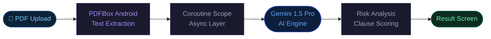

<div align="center">

<!-- ANIMATED TYPING BANNER -->
<a href="#">
  
</a>

<a href="#">
  
</a>

<br/><br/>

[](https://kotlinlang.org)
[](https://developer.android.com)
[](https://ai.google.dev)
[](https://m3.material.io)

[](LICENSE)
[]()
[](CONTRIBUTING.md)
[]()

</div>

<br/>

---

## `01` &nbsp; What Is ContractLens?

> **ContractLens** turns the black box of legal contracts into something you can actually understand — in seconds.

Most people sign contracts without fully reading them. Not because they're careless — because legal language is dense, obfuscated, and deliberately opaque. **ContractLens fixes that.**

Upload any PDF contract. ContractLens extracts the text, fires it through **Gemini 1.5 Pro**, and surfaces the risky clauses — explained in plain English, scored by severity, and delivered inside a clean Android interface.

It's not a PDF reader. It's a **risk engine**.

<br/>

---

## `02` &nbsp; Tech Stack

<br/>

<div align="center">

| Layer | Technology | Purpose |
|:---|:---|:---|
| **Language** |  Kotlin 2.0 | Primary application language |
| **Platform** |  Android SDK 34 | Mobile runtime target |
| **UI Layer** |  XML + Material 3 | View inflation and component system |
| **AI Engine** |  Gemini API | Contract analysis and risk extraction |
| **PDF Engine** |  Apache PDFBox | Text extraction from PDF contracts |
| **Async** |  Kotlin Coroutines | Non-blocking I/O and lifecycle-safe ops |
| **Design** |  Material Design 3 | Component tokens and theming |

</div>

<br/>

---

## `03` &nbsp; Feature Set

<br/>

<table>
<tr>
<td width="33%" valign="top">

### 📄 &nbsp; PDF Upload
Upload contracts directly from device storage. Any legal PDF, any size — no preprocessing, no file conversion required.

`PDFBox Android`

</td>
<td width="33%" valign="top">

### &nbsp; AI Risk Detection
Gemini 1.5 Pro identifies hidden liabilities, one-sided clauses, and legal traps in real time with zero manual review.

`Gemini 1.5 Pro`

</td>
<td width="33%" valign="top">

### &nbsp; Risk Scoring
Every clause rated **Low / Medium / High** severity with color-coded visual indicators and justification per flag.

`Per-clause grading`

</td>
</tr>
<tr>
<td width="33%" valign="top">

### &nbsp; Contract Analysis
Full clause-by-clause breakdown with section-level context preserved. No hallucinated summaries — grounded in your document.

`Deep parsing`

</td>
<td width="33%" valign="top">

### 💬 &nbsp; Plain English Output
Zero legal jargon. Every flagged risk explained in language a non-lawyer understands immediately. No law degree required.

`Human-readable`

</td>
<td width="33%" valign="top">

### 🖥️ &nbsp; Multi-Screen UI
Home → Upload → Analysis → Result. Clean navigation flow with persistent state and Material Design 3 throughout.

`Material Design 3`

</td>
</tr>
</table>

<br/>

---

## `04` &nbsp; Architecture Flow

<br/>



<br/>

<div align="center">

| Step | Component | What Happens |
|:---:|:---|:---|
| `01` | **PDF Upload** | User selects contract from device storage via file picker intent |
| `02` | **PDFBox Extraction** | Apache PDFBox parses PDF binary, extracts raw text preserving structure |
| `03` | **Coroutine Async Layer** | Extraction and API call dispatched on `IO` dispatcher, off main thread |
| `04` | **Gemini 1.5 Pro** | Structured prompt sent with full contract text, model returns clause analysis |
| `05` | **Risk Analysis** | Response parsed into clause objects with severity scores and explanations |
| `06` | **Result Screen** | Flagged clauses rendered in UI with risk levels, color coding, and summaries |

</div>

<br/>

---

## `05` &nbsp; Installation

```bash
# 1. Clone the repository
git clone https://github.com/yourusername/ContractLens.git
cd ContractLens

# 2. Open in Android Studio (Hedgehog or later)
# File → Open → select the ContractLens folder

# 3. Add your Gemini API key to local.properties
echo "GEMINI_API_KEY=your_key_here" >> local.properties

# 4. Sync Gradle
# Android Studio → File → Sync Project with Gradle Files

# 5. Run on device or emulator (API 26+ required)
# Run → Run 'app'  or  Shift+F10
```

<br/>

<div align="center">

| Requirement | Minimum | Recommended |
|:---|:---|:---|
| Android Studio | Hedgehog 2023.1.1 | Ladybug 2024.2.1+ |
| JDK | 17 | 17 |
| Android SDK | API 26 (Oreo) | API 34 (Android 14) |
| Gemini API Key | Required | [Get one free →](https://aistudio.google.com) |

</div>

<br/>

---

## `06` &nbsp; Engineering Challenges Solved

Real problems solved during development — not tutorials, not theory.

<br/>

<table>
<tr>
<td width="6%" valign="top"><code>01</code></td>
<td valign="top">

**Gradle API Key Injection**
Securely injecting the Gemini API key from `local.properties` into the build via `buildConfigField` — keeping secrets out of source control without sacrificing runtime access. Zero hardcoded credentials in any committed file.

</td>
</tr>
<tr>
<td valign="top"><code>02</code></td>
<td valign="top">

**Prompt Engineering for Legal Context**
Getting Gemini to produce consistent, structured output across wildly different contract types — NDAs, employment agreements, SaaS terms — required iterative prompt refinement with explicit output schema definitions and clause-boundary instructions.

</td>
</tr>
<tr>
<td valign="top"><code>03</code></td>
<td valign="top">

**Android Async Without Leaks**
Managing long-running PDF parsing and API calls without blocking the main thread. Coroutine scopes tied to ViewModel lifecycle prevent memory leaks and zombie operations when the user navigates away mid-analysis.

</td>
</tr>
<tr>
<td valign="top"><code>04</code></td>
<td valign="top">

**PDF Text Extraction at Scale**
PDFBox on Android has constraints the desktop version doesn't. Handled encoding edge cases, multi-column layouts, and contracts with embedded tables that naive extractors mangle — preserving clause structure for downstream AI parsing.

</td>
</tr>
<tr>
<td valign="top"><code>05</code></td>
<td valign="top">

**API Quota Debugging**
Gemini free-tier quota limits hit fast during development. Implemented proper error state handling, descriptive user-facing feedback, and identified the specific request patterns that triggered rate limiting early in the cycle.

</td>
</tr>
<tr>
<td valign="top"><code>06</code></td>
<td valign="top">

**Structured Output from Unstructured Input**
Legal documents have no standard format. Built a prompt pipeline that forces clause-level specificity from Gemini regardless of document structure — consistently returning parseable, predictable output across wildly different contract formats.

</td>
</tr>
</table>

<br/>

---

## `07` &nbsp; Roadmap

<br/>

<div align="center">

| Status | Feature | Notes |
|:---:|:---|:---|
| ✅ | PDF upload and text extraction | Shipped |
| ✅ | Gemini AI integration | Shipped |
| ✅ | Risk identification and plain English output | Shipped |
| ✅ | Multi-screen Android UI | Shipped |
| ✅ | Error handling and loading states | Shipped |
| ⬜ | Structured clause cards with expandable detail | In design |
| ⬜ | Retry system with exponential backoff | Planned |
| ⬜ | Analysis history — local persistence via Room | Planned |
| ⬜ | Enhanced UI micro-animations and transitions | Planned |
| ⬜ | Cloud sync for cross-device analysis access | Future |
| ⬜ | Premium legal insight tier — jurisdiction-aware | Future |
| ⬜ | Clause comparison across multiple contracts | Future |
| ⬜ | Export risk report as shareable PDF | Future |

</div>

<br/>

---

## `08` &nbsp; Contributing

Contributions are welcome — but read this first.

```bash
# 1. Fork the repository on GitHub

# 2. Create a focused feature branch
git checkout -b feature/your-feature-name

# 3. Commit with intent — what changed and why
git commit -m "feat: add exponential backoff for Gemini API retries"

# 4. Push your branch
git push origin feature/your-feature-name

# 5. Open a Pull Request with context
# Describe what you changed, why, and how you tested it
```

> **Before opening a PR:** Bug fix? Reference the issue number. New feature? Open a discussion first. PRs that add dependencies without justification will be closed. Small improvements — typos, docs, tests — are always welcome.

<br/>

---

## `09` &nbsp; License

```
MIT License — use it, build on it, ship it.
Attribution appreciated. Credit optional but respected.
```

See [`LICENSE`](LICENSE) for full terms.

<br/>

---

<br/>

<div align="center">

<a href="#">
  
</a>

<br/><br/>

[](https://github.com/yourusername/ContractLens/stargazers)
[](https://github.com/yourusername/ContractLens/network/members)
[](https://github.com/yourusername/ContractLens/issues)

<br/>

**Built with** &nbsp;


<br/>

*If ContractLens helped you or impressed you — drop a ⭐. It costs nothing and means something.*

</div>
